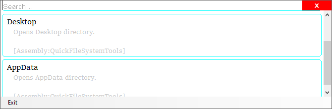

# Quick

A C# tool that provides user fast access to executing tasks. 

Once the app has been launch, you can press `Alt+Win+Q` to open the Quick window and choose your task. 

The application is expandable by plugins. It comes along with a built-in example DLL which provides shortcuts
to some Windows specific paths (Desktop, AppData etc - I created this to improve my QoL at a time when I didn't know too many about cmd, `%APPDATA%` or even the `Win+R` Run shortcut).

## Screenshots

</img>